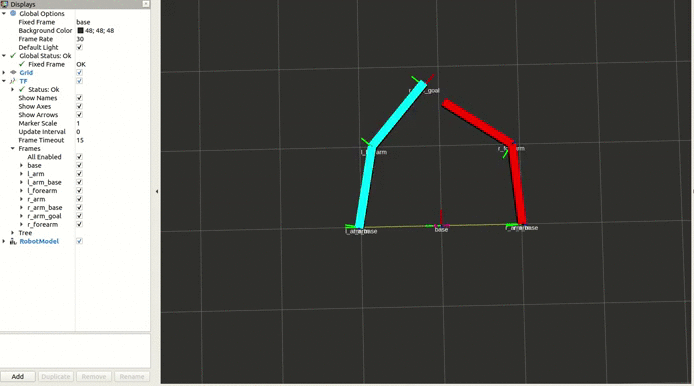

[![Contributors][contributors-shield]][contributors-url]
[![Forks][forks-shield]][forks-url]
[![Stargazers][stars-shield]][stars-url]
[![Issues][issues-shield]][issues-url]
[![MIT License][license-shield]][license-url]
[![LinkedIn][linkedin-shield]][linkedin-url]

<br />

  <h3 align="center">Dual Puppet Arm</h3>

  <p align="center">
    A ROS package for controlling an arm as a puppet of the other arm. Usage of services and tf.
    <br />
    <a href="https://github.com/master-coro/dual_planar/readme.md"><strong>Explore the docs »</strong></a>
    <br />
    <br />
    <a href="https://github.com/master-coro/dual_planar">View Demo</a>
    ·
    <a href="https://github.com/master-coro/dual_planar/issues">Report Bug</a>
    ·
    <a href="https://github.com/master-coro/dual_planar/issues">Request Feature</a>
  </p>
</p>

## Demonstration

<p align="center">
    <!--- relative path means image/image.png instead of https://etc... -->
                               
</a>

## Setup

1. (Optional) Click on `Fork`
2. Clone the project on your local machine.
```shell
$ cd ~/catkin_ws/src
$ git clone https://github.com/master-coro/dual_arm.git
```
3. Install dependencies
```shell
$ rosdep install follow_leader 
$ rosdep install --from-paths src --ignore-src -r -y
```

## Run

```shell
$ cd ~/catkin_ws
$ catkin_make
$ roslaunch dual_arm complete.launch
```

## Contribute

Contributions are what make the open source community such an amazing place to learn, inspire, and create. Any contributions you make are **greatly appreciated**.

### Contribute on proposed features

1. Choose any open issue from [here](https://github.com/master-coro/dual_arm/issues). 
2. Comment on the issue: `Can I work on this?` and get assigned.
3. Make changes to your `Fork` and send a PR.

Otherwise just create the issue yourself, and we'll discuss and assign you to it if serves the project !

To create a PR:

Follow the given link to make a successful and valid PR: https://help.github.com/articles/creating-a-pull-request/

To send a PR, follow these rules carefully, **otherwise your PR will be closed**:

1. Make PR title in this formats: 
```
Fixes #IssueNo : Name of Issue
``` 
```
Feature #IssueNo : Name of Issue
```
```
Enhancement #IssueNo : Name of Issue
```

According to what type of issue you believe it is.

For any doubts related to the issues, i.e., to understand the issue better etc, comment down your queries on the respective issue.

## License

Distributed under the MIT License. See `LICENSE` for more information.

## Contact

Erwin Lejeune - [@spida_rwin](https://twitter.com/spida_rwin) - erwin.lejeune15@gmail.com

## Contributors

- [Erwin Lejeune](https://github.com/Guilyx)

[contributors-shield]: https://img.shields.io/github/contributors/master-coro/follow_leader.svg?style=flat-square
[contributors-url]: https://github.com/master-coro/follow_leader/graphs/contributors
[forks-shield]: https://img.shields.io/github/forks/master-coro/follow_leader.svg?style=flat-square
[forks-url]: https://github.com/master-coro/follow_leader/network/members
[stars-shield]: https://img.shields.io/github/stars/master-coro/follow_leader.svg?style=flat-square
[stars-url]: https://github.com/master-coro/follow_leader/stargazers
[issues-shield]: https://img.shields.io/github/issues/master-coro/follow_leader.svg?style=flat-square
[issues-url]: https://github.com/master-coro/follow_leader/issues
[license-shield]: https://img.shields.io/github/license/master-coro/follow_leader.svg?style=flat-square
[license-url]: https://github.com/master-coro/follow_leader/blob/master/LICENSE.md
[linkedin-shield]: https://img.shields.io/badge/-LinkedIn-black.svg?style=flat-square&logo=linkedin&colorB=555
[linkedin-url]: https://linkedin.com/in/erwinlejeune-lkn
